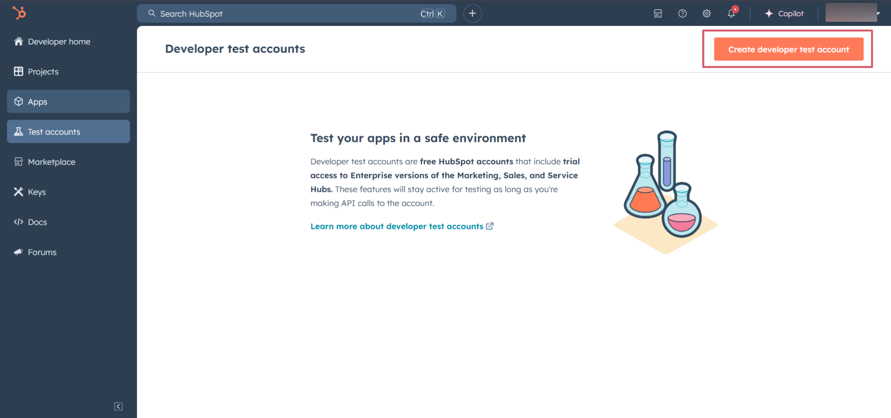
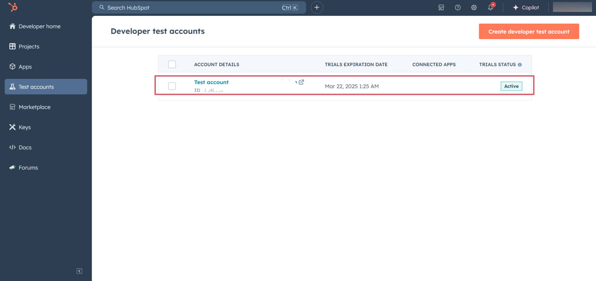
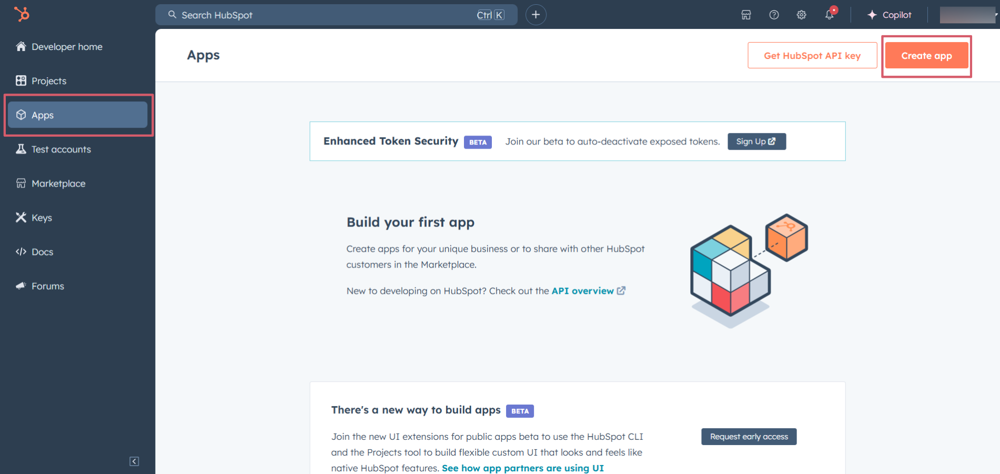
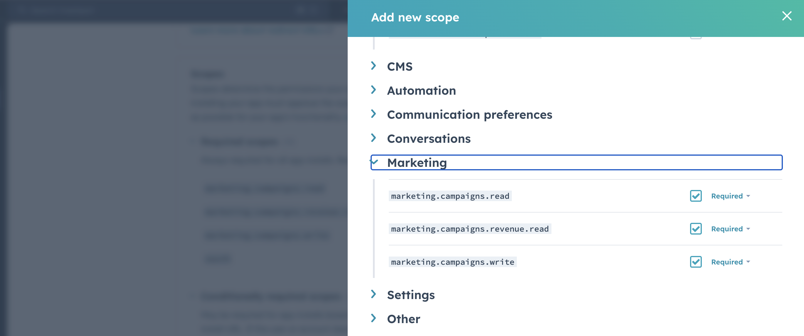
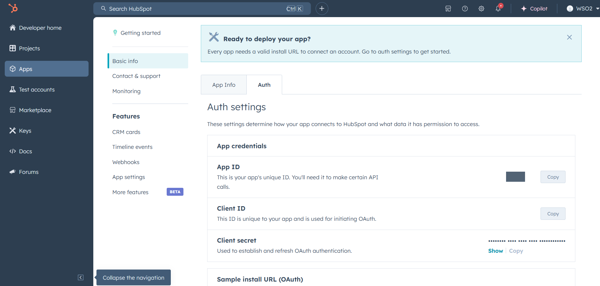
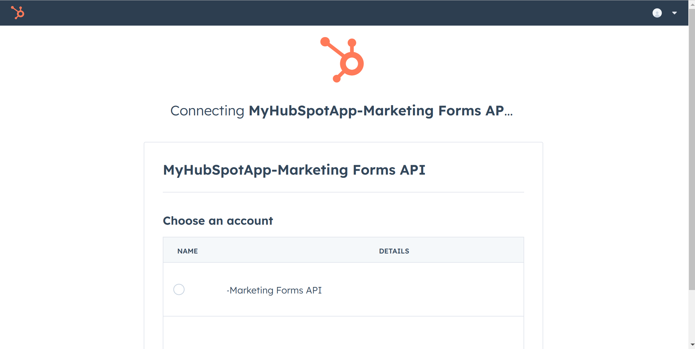

# Ballerina HubSpot Marketing Campaigns Connector

[](https://github.com/ballerina-platform/module-ballerinax-hubspot.marketing.campaigns/actions/workflows/ci.yml)
[](https://github.com/ballerina-platform/module-ballerinax-hubspot.marketing.campaigns/actions/workflows/trivy-scan.yml)
[](https://github.com/ballerina-platform/module-ballerinax-hubspot.marketing.campaigns/actions/workflows/build-with-bal-test-graalvm.yml)
[](https://github.com/ballerina-platform/module-ballerinax-hubspot.marketing.campaigns/commits/master)
[](https://github.com/ballerina-platform/ballerina-library/labels/module%hubspot.marketing.campaigns)

## Overview

[HubSpot](https://www.hubspot.com) is an AI-powered customer relationship management (CRM) platform.

The `ballerinax/module-ballerinax-hubspot.marketing.campaigns` connector offers APIs to connect and interact with the [Hubspot Marketing Campaigns API](https://developers.hubspot.com/docs/guides/api/marketing/campaigns) endpoints, specifically based on the [HubSpot REST API](https://developers.hubspot.com/docs/reference/api/overview)

## Setup guide

To use the HubSpot Marketing Campaigns connector, you must have access to the HubSpot API through a HubSpot developer account and a HubSpot App under it. Therefore you need to register for a developer account at HubSpot if you don't have one already.

### Step 1: Create/Login to a HubSpot Developer Account

If you have an account already, go to the [HubSpot developer portal](https://developers.hubspot.com/)

If you don't have a HubSpot Developer Account you can sign up to a free account [here](https://developers.hubspot.com/get-started)

### Step 2 (Optional): Create a Developer Test Account
Within app developer accounts, you can create a [developer test account](https://developers.hubspot.com/docs/getting-started/account-types#developer-test-accounts) under your account to test apps and integrations without affecting any real HubSpot data.

> **Note**: These accounts are only for development and testing purposes. In production you should not use Developer Test Accounts.

   1. Go to Test accounts section from the left sidebar.


   2. Click on the Create developer test account button on the top right corner.



   3. In the pop-up window, provide a name for the test account and click on the Create button.


   4. You will see the newly created test account in the list of test accounts.



### Step 3: Create a HubSpot App

   1. Navigate to the Apps section from the left sidebar and click on the Create app button on the top right corner.



   2. Provide a public app name and description for your app.


### Step 4: Setup Authentication

   1. Move to the Auth tab.


   2. In the Scopes section, add the following scopes for your app using the Add new scopes button.
        - `marketing.campaigns.read`
        - `marketing.campaigns.revenue.read`
        - `marketing.campaigns.write`



   3. In the Redirect URL section, add the redirect URL for your app. This is the URL where the user will be redirected after the authentication process. You can use `localhost` for testing purposes. Then click the "Create App" button.


### Step 5: Get the Client ID and Client Secret

Navigate to the Auth tab and you will see the `Client ID`, and `Client Secret` for your app. Make sure to save these values.



### Step 6: Setup Authentication Flow

Before proceeding with the Quickstart, ensure you have obtained the Access Token using the following steps:

   1. Create an authorization URL using the following format:

      ```
      https://app.hubspot.com/oauth/authorize?client_id=<YOUR_CLIENT_ID>&scope=<YOUR_SCOPES>&redirect_uri=<YOUR_REDIRECT_URI>
      ```
   Replace the `<YOUR_CLIENT_ID>`, `<YOUR_REDIRECT_URI>`, and `<YOUR_SCOPES>` with your specific value.

   2. Paste it in the browser and select your developer test account to intall the app when prompted.

   

   3. A code will be displayed in the browser. Copy the code.

   4. Run the following curl command. Replace the `<YOUR_CLIENT_ID>`, `<YOUR_REDIRECT_URI>`, and `<YOUR_CLIENT_SECRET>` with your specific value. Use the code you received in the above step 3 as the CODE below

   - Linux/macOS
   ```bash
   curl --request POST \
--url https://api.hubapi.com/oauth/v1/token \
--header 'content-type: application/x-www-form-urlencoded' \
--data 'grant_type=authorization_code&code=<CODE>&redirect_uri=<YOUR_REDIRECT_URI>&client_id=<YOUR_CLIENT_ID>&client_secret=<YOUR_CLIENT_SECRET>'
   ```

   - Windows
   ```bash
curl --request POST ^
--url https://api.hubapi.com/oauth/v1/token ^
--header 'content-type: application/x-www-form-urlencoded' ^
--data 'grant_type=authorization_code&code=<CODE>&redirect_uri=<YOUR_REDIRECT_URI>&client_id=<YOUR_CLIENT_ID>&client_secret=<YOUR_CLIENT_SECRET>'
   ```

This command will return the access token necessary for API calls.

```json
{
  "token_type": "bearer",
  "refresh_token": "<Refresh Token>",
  "access_token": "<Access Token>",
  "expires_in": 1800
}
```

   5. Store the access token securely for use in your application.


## Quickstart

To use the HubSpot Marketing Campaigns connector in your Ballerina application, update the `.bal` file as follows:

### Step 1: Import the module

Import the `ballerinax/hubspot.marketing.campaigns` module and `ballerina/oauth2` module.

```ballerina
import ballerinax/hubspot.marketing.campaigns as hsmcampaigns;
import ballerina/oauth2;
```

### Step 2: Instantiate a new connector

   1. Create a `Config.toml` file and, configure the obtained credentials in the above steps as follows:

```toml
 clientId = <Client Id>
 clientSecret = <Client Secret>
 refreshToken = <Refresh Token>
```

   2. Instantiate a `hsmcampaigns:ConnectionConfig` with the obtained credentials and initialize the connector with it.

```ballerina
configurable string clientId = ?;
configurable string clientSecret = ?;
configurable string refreshToken = ?;

final hsmcampaigns:ConnectionConfig hsmcampaignsConfig = {
    auth : {
        clientId,
        clientSecret,
        refreshToken,
        credentialBearer: oauth2:POST_BODY_BEARER
    }
};

final hsmcampaigns:Client hsmCampaignsClient = check new (hsmcampaignsConfig);
```

### Step 3: Invoke the connector operation

Now, utilize the available connector operations. A sample usecase is shown below.

Retrieve a Marketing Campaign

```ballerina
public function main() returns error? {
    hsmcampaigns:CollectionResponseWithTotalPublicCampaignForwardPaging campaigns = check hsmCampaignsClient->/marketing/v3/campaigns.get();
}
```


## Examples

The `HubSpot Marketing Campaigns ` connector provides practical examples illustrating usage in various scenarios. Explore these [examples](https://github.com/ballerina-platform/module-ballerinax-hubspot.marketing.campaigns/tree/main/examples), covering the following use cases:

1. [Batch of Campaigns](examples/batch_of_campaigns) - Fully manage a batch of campaigns
2. [Campaign Lifecycle with Assets](examples/campaign_lifecycle_with_assets) - Full life cycle of a campaign associated with assets such as forms

## Build from the source

### Setting up the prerequisites

1. Download and install Java SE Development Kit (JDK) version 21. You can download it from either of the following sources:

    * [Oracle JDK](https://www.oracle.com/java/technologies/downloads/)
    * [OpenJDK](https://adoptium.net/)

   > **Note:** After installation, remember to set the `JAVA_HOME` environment variable to the directory where JDK was installed.

2. Download and install [Ballerina Swan Lake](https://ballerina.io/).

3. Download and install [Docker](https://www.docker.com/get-started).

   > **Note**: Ensure that the Docker daemon is running before executing any tests.

4. Export Github Personal access token with read package permissions as follows,

    ```bash
    export packageUser=<Username>
    export packagePAT=<Personal access token>
    ```

### Build options

Execute the commands below to build from the source.

1. To build the package:

   ```bash
   ./gradlew clean build
   ```

2. To run the tests:

   ```bash
   ./gradlew clean test
   ```

3. To build the without the tests:

   ```bash
   ./gradlew clean build -x test
   ```

4. To run tests against different environments:

   ```bash
   ./gradlew clean test -Pgroups=<Comma separated groups/test cases>
   ```

5. To debug the package with a remote debugger:

   ```bash
   ./gradlew clean build -Pdebug=<port>
   ```

6. To debug with the Ballerina language:

   ```bash
   ./gradlew clean build -PbalJavaDebug=<port>
   ```

7. Publish the generated artifacts to the local Ballerina Central repository:

    ```bash
    ./gradlew clean build -PpublishToLocalCentral=true
    ```

8. Publish the generated artifacts to the Ballerina Central repository:

   ```bash
   ./gradlew clean build -PpublishToCentral=true
   ```

## Contribute to Ballerina

As an open-source project, Ballerina welcomes contributions from the community.

For more information, go to the [contribution guidelines](https://github.com/ballerina-platform/ballerina-lang/blob/master/CONTRIBUTING.md).

## Code of conduct

All the contributors are encouraged to read the [Ballerina Code of Conduct](https://ballerina.io/code-of-conduct).

## Useful links

* For more information go to the [`hubspot.marketing.campaigns` package](https://central.ballerina.io/ballerinax/hubspot.marketing.campaigns/latest).
* For example demonstrations of the usage, go to [Ballerina By Examples](https://ballerina.io/learn/by-example/).
* Chat live with us via our [Discord server](https://discord.gg/ballerinalang).
* Post all technical questions on Stack Overflow with the [#ballerina](https://stackoverflow.com/questions/tagged/ballerina) tag.
